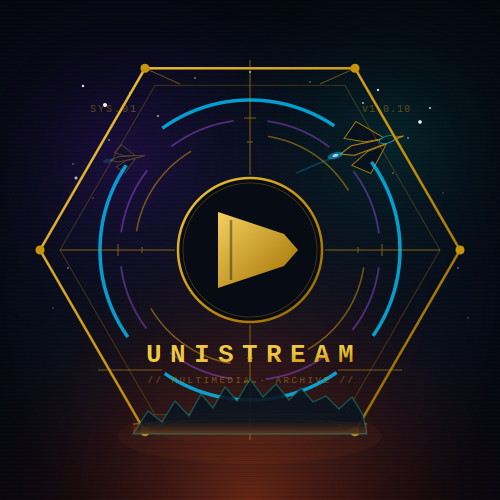

<p align="center">
  
</p>

<h1 align="center">UniStream</h1>

<p align="center">
  <em>Bibliothèque multimédia de poche — Anime · Drama · Films · Séries</em>
</p>

<p align="center">
  
  
  
  
</p>

---

> **UniStream** est une bibliothèque multimédia de poche, disponible sur mobile, desktop et web.
> Retrouvez et organisez vos animes préférés depuis une interface moderne et fluide, alimentée par une [API de scraping dédiée](https://github.com/Dev-Skortana/api-unistream).

---

## 📸 Aperçu

| Écran d'accueil | Bibliothèque |
|:-:|:-:|
|  |  |

---

## 🏗️ Architecture du projet

```
UniStream
├── UniStream-Flutter (ce dépôt)  → Application mobile/desktop/web (Dart / Flutter)
├── unistream_packages            → Packages Flutter de scraping (XPath selectors — système actuel)
└── api-unistream                 → Refonte du scraping (Python / FastAPI + Crawl4AI — en cours)
```

> L'application a été développée à l'origine en **Python avec Flet** (framework Flutter pour Python), puis réécrite en **Flutter / Dart natif**. L'extraction des données vidéo repose actuellement sur des **sélecteurs XPath** embarqués dans `unistream_packages`. La migration vers l'API `api-unistream` (FastAPI + Crawl4AI) est en cours afin de centraliser et automatiser cette logique hors de l'application mobile.

---

## ⚙️ Stack technique

| Composant         | Technologie                              |
|-------------------|------------------------------------------|
| Framework         | Flutter 3.x                              |
| Langage           | Dart                                     |
| Base de données   | SQLite (via Docker pour l'administration)|
| Plateformes       | Android, iOS, Web, Linux, macOS, Windows |
| CI/CD             | GitHub Actions                           |

---

## 🚀 Démarrage rapide

### Prérequis

- [Flutter SDK](https://docs.flutter.dev/get-started/install) (version 3.x ou supérieure)
- Un émulateur ou un appareil physique connecté
- L'[API UniStream](https://github.com/Dev-Skortana/api-unistream) en cours d'exécution (optionnel pour le scraping)

### Installation

```bash
# Cloner le dépôt
git clone https://github.com/Dev-Skortana/UniStream-Flutter.git
cd UniStream-Flutter

# Installer les dépendances
flutter pub get

# Lancer l'application
flutter run
```

### Cibler une plateforme spécifique

```bash
flutter run -d android    # Android
flutter run -d ios        # iOS
flutter run -d chrome     # Web
flutter run -d linux      # Linux
flutter run -d windows    # Windows
flutter run -d macos      # macOS
```

---

## 🗂️ Structure du projet

```
.
├── lib/                        # Code source principal (Dart)
├── assets/                     # Images, icônes, ressources statiques
├── android/                    # Configuration Android native
├── ios/                        # Configuration iOS native
├── web/                        # Configuration Web
├── linux/                      # Configuration Linux desktop
├── macos/                      # Configuration macOS desktop
├── windows/                    # Configuration Windows desktop
├── utils/                      # Utilitaires et helpers
├── docker_use_image/
│   └── sqlite_browser/config/  # Configuration SQLite Browser (Docker)
├── .github/workflows/          # Pipelines CI/CD
├── pubspec.yaml                # Dépendances et configuration Flutter
├── flutter_01.png              # Screenshot de l'app
├── flutter_02.png              # Screenshot de l'app
└── Crédits.txt                 # Attributions et crédits
```

---

## 🗄️ Base de données locale

L'application utilise **SQLite** pour stocker la bibliothèque multimédia en local. Un outil d'administration SQLite est disponible via Docker pour faciliter le développement :

```bash
cd docker_use_image/sqlite_browser
docker compose up -d
```

Accédez ensuite à l'interface d'administration sur **http://localhost:3000**.

---

## 🔄 CI/CD — GitHub Actions

Les workflows GitHub Actions automatisent les vérifications à chaque push sur la branche principale.

| Workflow          | Déclencheur     | Description                    |
|-------------------|-----------------|--------------------------------|
| `publish-*.yaml`  | Push sur `main` | Build et publication de release |

### Créer une release

Les releases sont créées automatiquement lors du push d'un tag Git au format `v*` :

```bash
git tag v1.0.11
git push origin v1.0.11
```

La dernière release disponible est la **v1.0.10** (23 février 2026).

---

## 🔗 Projets liés

| Dépôt | Description |
|---|---|
| [unistream_packages](https://github.com/Dev-Skortana/unistream_packages) | Packages Flutter de scraping — extraction via XPath selectors (système actuel) |
| [api-unistream](https://github.com/Dev-Skortana/api-unistream) | Refonte du scraping vers FastAPI + Crawl4AI (en cours) |

---

## 📄 Crédits

Voir le fichier [`Crédits.txt`](./Crédits.txt) pour les attributions et ressources utilisées.